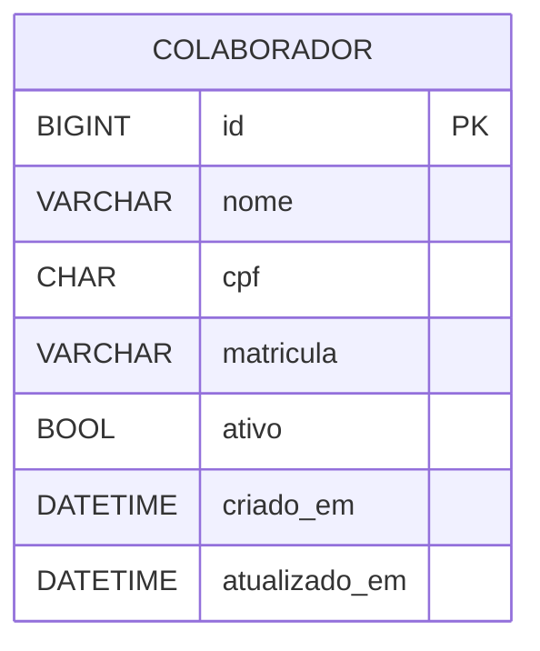
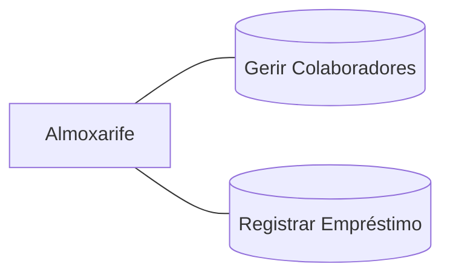
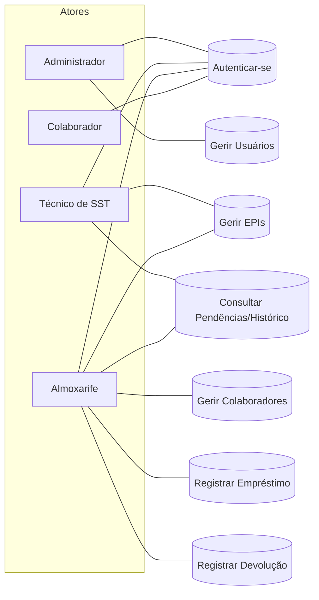

# Sistema de Controle de EPIs (Django)

MVP completo com:
- CRUD de **Colaboradores**
- CRUD de **EPIs** com estoque simples e CA (nº e validade)
- **Empréstimos** com 1..N itens (quantidade, status)
- **Devolução** total/parcial (status por item) com recomposição automática de estoque para *Devolvido*
- **Relatório** por colaborador (nome, equipamento, datas e status)
- Dashboard com contadores básicos

  ---
  
## Como rodar (dev)
```bash
pip install -r requirements.txt
cp .env.example .env  # ajuste se usar MySQL; por padrão SQLite roda sem mudanças
python manage.py makemigrations
python manage.py migrate
python manage.py runserver
```
Acesse: http://127.0.0.1:8000/

---

## Rotas principais
- `/` (Dashboard)
- `/colaboradores/` (CRUD)
- `/epis/` (CRUD)
- `/emprestimos/` (listagem e acesso ao editar/devolver)
- `/emprestimos/novo/`
- `/relatorios/colaborador/`
  
---

## Observações
- Campos de **Devolução** e **Observação** só aparecem quando o status do item é *Devolvido/Danificado/Perdido*.
- Em **criação** de empréstimo, os status disponíveis são: *Emprestado*, *Em Uso* e *Fornecido*.
- Regras de negócio incluídas: quantidade>0, estoque suficiente, devolução recompõe estoque, empréstimo fecha quando não há pendências.

---

## 🚀 Como executar (VS Code)

## 1) Clone / crie o projeto
 ```
 git clone https://github.com/<sua-conta>/epi-mvp.git
cd epi_mvp
```
---
## 2) Ambiente virtual
```
python -m venv .venv
 Windows: .venv\Scripts\activate
 Linux/Mac:
source .venv/bin/activate
```
---
## 3) Dependências
```
pip install -r requirements.txt
```
---

## 4) Configurar variáveis (copie e edite .env)
```
cp .env.example .env
```
---

## 5) Migrações
```
python manage.py makemigrations colaboradores
python manage.py migrate
```
---

## 6) Rodar
```python manage.py runserver
# Abra http://127.0.0.1:8000/ (redireciona para /colaboradores/)
```
> Obs.: o banco configurado no `.env` (DB_NAME=epi_simplificado) deve existir em seu MySQL.

---

## 👤 Acesso ao admin (opcional)
```bash
python manage.py createsuperuser
# depois acesse: http://127.0.0.1:8000/admin/
```
---

## 🧭 Rotas principais
- `GET /colaboradores/` — lista com paginação e busca
- `GET /colaboradores/novo/` — formulário de criação
- `GET /colaboradores/<id>/editar/` — edição
- `GET /colaboradores/<id>/excluir/` — confirmação de exclusão
---

## 🗃️ Diagrama ER (Mermaid)

---

## 🧩 Caso de Uso (Mermaid)

---

## ✅ Requisitos cobertos
- CRUD completo de Colaboradores.
- Persistência MySQL via ORM.
- Validações de unicidade (CPF, matrícula).
- Busca e paginação.

---

## 🧪 Teste rápido
1. Suba o MySQL (local ou via docker-compose).
2. `python manage.py migrate`
3. Acesse `/colaboradores/`, crie/edite/exclua, e verifique no banco.

---

# 📌 Sistema de Controle de EPIs

## 1) Escopo resumido
**Objetivo:** controlar cadastro de EPIs, colaboradores e o empréstimo/devolução de itens.  

**Perfis de usuário:**  
- ADMIN  
- TECNICO_SST  
- ALMOXARIFE  
- COLABORADOR  

(campo `perfil` em **usuario**)  

---

## 2) DER 


--- 

## 3) Diagrama de Casos de Uso



---

## 4) Requisitos Funcionais

RF01 — Autenticação e perfil: login por e-mail/senha; acesso conforme perfil.

RF02 — Cadastro de colaboradores: CRUD básico; validações de CPF e matrícula únicos.

RF03 — Cadastro de EPIs: CRUD básico; controle simples de estoque (inteiro), ca_numero e ca_validade (opcional).

RF04 — Empréstimo: criar cabeçalho (emprestimo) e itens (emprestimo_item) com quantidade; reduzir epi.estoque.

RF05 — Devolução: registrar devolvido_em por item; somar de volta no epi.estoque.

RF06 — Consulta: listar pendências de devolução por colaborador e histórico por período.

RF07 — Alertas simples (opcional): destacar itens com previsão vencida ou CA expirado.

---

## 5) Requisitos Não Funcionais

RNF01 — Usabilidade: até 3 cliques para registrar empréstimo; layout responsivo.

RNF02 — Segurança: senha com hash; perfis aplicados no backend; sessões expiram por inatividade.

RNF03 — Desempenho: listagens comuns em até 2s em rede local.

RNF04 — Disponibilidade: uso em horário comercial; backup diário do banco.

RNF05 — Manutenibilidade: arquitetura em camadas (API, serviço, persistência) + logs mínimos de erro.

RNF06 — Portabilidade: MySQL 8.0+, compatível com Workbench.

---

## 6) Wireframes (mínimos)

```text
Login
+-------------------------+
|  LOGO                   |
|  Login: [___________]   |
|  Senha: [___________]   |
|  [ Entrar ]             |
+-------------------------+

Dashboard
+----------------------------------------------------+
| Pendentes de Devolução: [12]  | Empréstimos hoje: 5|
| CA(s) de EPI vencidos: 2 (alerta)                  |
| Busca rápida: [ Colaborador / EPI ]                |
+----------------------------------------------------+

EPIs (CRUD + estoque simples)
[ + Novo EPI ]  [Buscar: __________ ]
| Código | Nome | Tamanho | CA | Validade | Estoque | Ações |

Colaboradores
[ + Novo Colaborador ] [Buscar: _______ ]
| Matrícula | Nome | CPF | Ativo | Ações |

Empréstimos
[ + Novo Empréstimo ] [Buscar por colaborador: ______ ]
| Nº | Colaborador | Itens Pendentes | Prev. Devolução | Status | Ações |

Novo Empréstimo
Colaborador: [selecionar]
Itens:
  [ + Adicionar EPI ]
   -> EPI [select]  Quantidade [__]  [Remover]
Previsão devolução: [data/hora]
[ Confirmar ]  [ Cancelar ]

Devolução
Filtro: [Colaborador] [Somente pendentes]
| Empréstimo | EPI | Qtde | Entregue em | Devolver [__] | Ação |
[ Confirmar devolução ]

```

--- 

## 7) Regras de Negócio

RB01: quantidade > 0 em emprestimo_item.

RB02: Não permitir saída se epi.estoque < quantidade.

RB03: Devolução soma quantidade ao epi.estoque e preenche devolvido_em.

RB04: Se ca_validade existir e estiver vencida, exibir aviso (não bloqueia no mínimo).

RB05: status do empréstimo vai para FECHADO quando todos os itens forem devolvidos.

---

## 8) Critérios de Aceite (MVP)

✅ Cadastrar usuários, colaboradores e EPIs.
✅ Criar empréstimo com 1..N itens e reduzir estoque.
✅ Registrar devolução total/parcial e recompor estoque.
✅ Listar pendências por colaborador e fechar empréstimo quando não houver mais pendências.
✅ Exportar listagens em CSV (opcional).

---
## 🧪 Testes (pytest + Django)

Este projeto usa **pytest** com **pytest-django** para testes **unitários** e **de integração**.

### 📂 Estrutura dos testes
```
tests/
├─ unit/                      # Testes unitários (modelo, validações, regras de negócio)
│  ├─ test_models_colaborador_unit.py
│  ├─ test_models_emprestimos_unit.py
│  └─ test_models_epi_ca_unit.py
└─ integration/               # Testes de integração (views, rotas, relatórios)
   ├─ test_colaboradores_integration.py
   ├─ test_emprestimos_integration.py
   ├─ test_epi_integration.py
   ├─ test_epi_ca_integration.py
   └─ test_routes_integration.py
```

### ⚙️ `pytest.ini`
```ini
[pytest]
DJANGO_SETTINGS_MODULE = epi_mvp.settings
django_find_project = true
testpaths = tests
python_files = test_*.py *_test.py
addopts = -q
filterwarnings =
    ignore::django.utils.deprecation.RemovedInDjango50Warning
    ignore::django.utils.deprecation.RemovedInDjango51Warning
```

> **Observação:** Os testes rodam por padrão com o banco configurado em `epi_mvp.settings`.  
> Para **testes**, é recomendável deixar **SQLite** (rápido e isolado).  
> Em produção/dev, use **MySQL** via `.env`.

---

### ▶️ Como executar

#### Rodar todos os testes
```bash
pytest -vv
```

#### Mostrar apenas a coleta
```bash
pytest --collect-only -q
```

#### Rodar com cobertura
```bash
python -m pip install coverage
python -m coverage run -m pytest
python -m coverage report -m
python -m coverage html
# abrir htmlcov/index.html no navegador
```

---

### 🧩 Convenções (o que é testado)

**Unitários (`tests/unit/`):**
- Modelos / Regras de negócio (ex.: validação de CPF, quantidade > 0, recomposição de estoque).  
- **EPI – CA:** cobre validade expirada e válida.

**Integração (`tests/integration/`):**
- Views / Rotas (CRUD de colaboradores, EPIs, CSVs, dashboard e relatórios).  
- Fluxos completos (criar empréstimo → reduzir estoque → devolver → recompor estoque).

---

### 🧱 Exemplos de testes

#### Unitário — validade de CA
```python
@pytest.mark.django_db
def test_formulario_epi_ca_expirado_invalido_se_existir():
    ...
```

#### Unitário — regra de negócio (estoque)
```python
@pytest.mark.django_db
def test_excluir_item_pendente_restaura_estoque():
    ...
```

#### Integração — CRUD EPI
```python
@pytest.mark.django_db
def test_criacao_ok(client):
    data = {"codigo":"LUV-123", "nome":"Luva", "tamanho":"M", "estoque":5, "ativo":True}
    resp = client.post(reverse("epi:create"), data, follow=True)
    assert resp.status_code == 200
    assert Epi.objects.filter(codigo="LUV-123").exists()
```

---

### ⚙️ CI (GitHub Actions) — opcional
```yaml
name: tests
on: [push, pull_request]
jobs:
  pytest:
    runs-on: ubuntu-latest
    steps:
      - uses: actions/checkout@v4
      - uses: actions/setup-python@v5
        with:
          python-version: '3.12'
      - name: Install deps
        run: |
          python -m pip install --upgrade pip
          pip install -r requirements.txt
          pip install pytest pytest-django coverage
      - name: Run tests with coverage
        run: |
          python -m coverage run -m pytest -vv
          python -m coverage report -m
```

---

### 📊 Evidências (exemplo real)

**Coleta:**
```
pytest --collect-only -q
# total: 41 testes
```

**Execução:**
```
================================================================== 41 passed in 2.03s ==================================================================
```

**Cobertura:**
```
TOTAL 851 statements, 82% cobertura
```
